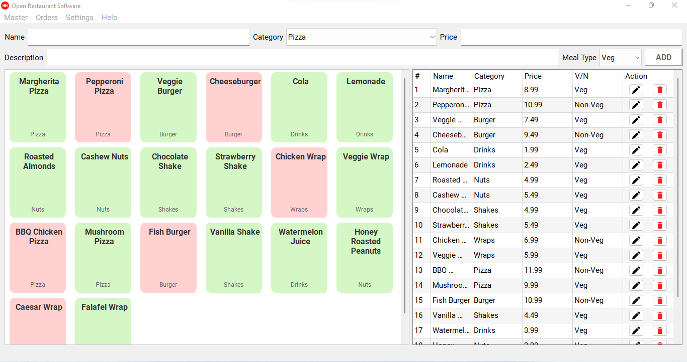

# Open Restaurant Software

Open-source restaurant management software built with Python and Qt, designed to streamline restaurant operations. This application provides a complete suite of features, including Category Management, Item Management, Orders, Tables, and Reports.

## Key Features

- **Category Management**: Manage food and beverage categories for easy organization.
- **Item Management**: Add, update, or delete menu items, with detailed information for each item.
- **Orders**: Create and track orders in real-time to improve service efficiency.
- **Table Management**: Organize table seating and status to streamline reservations and service.
- **Reports**: Generate comprehensive reports on sales, order history, and more for insightful analysis.

Under Development ;)
